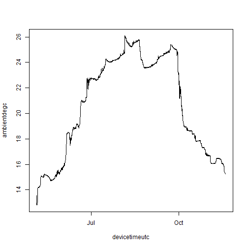
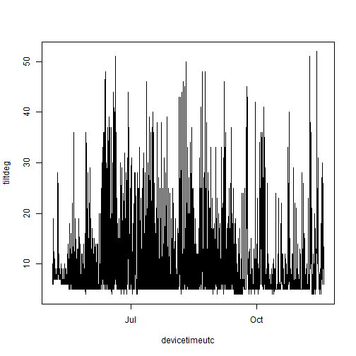
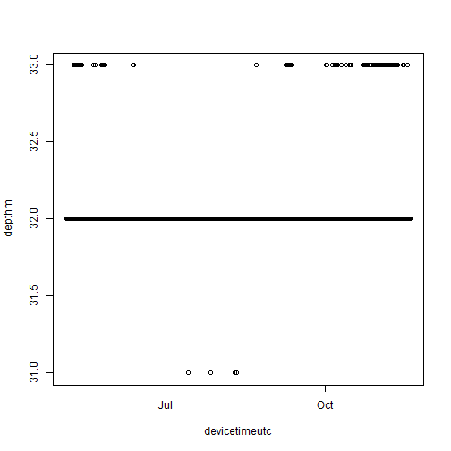
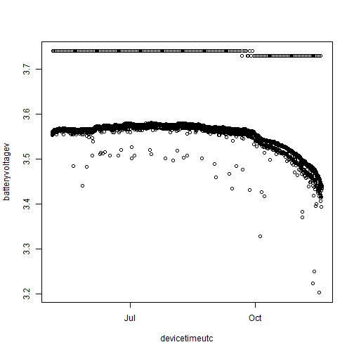
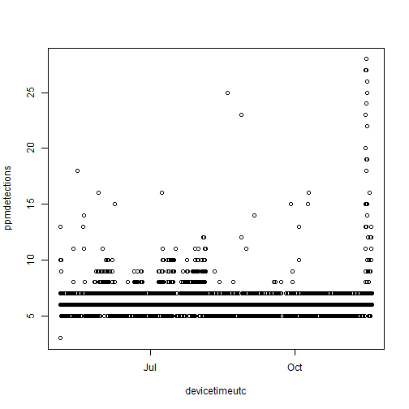
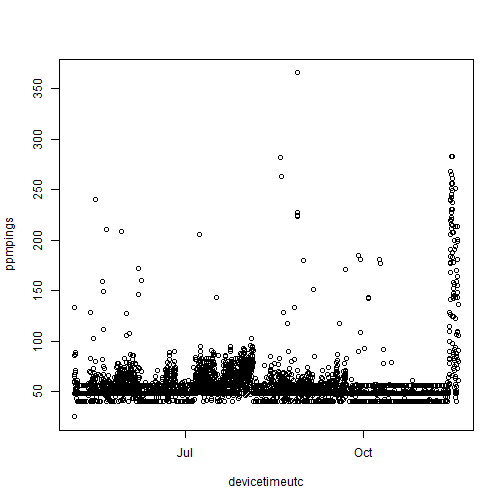

We often want to extract the environmental data that some of our receivers log. You can do this by going into Innovasea's VUE or Fathom Connect programs and clicking a bunch of buttons, or you can do it programmatically and reproducibly by combining `matos` and [`rvdat`](https://rvdat.obrien.page).


```r
library(matos)
library(rvdat)
```

## Download the data

First, log into your MATOS account.


```r
matos_login()
#> ! Please log in.
#> ✔ Login successful!
```

Next, tell `rvdat` the location of the `vdat.exe` executable (check out the [`rvdat` documentation](https://rvdat.obrien.page) for more information on this).


```r
vdat_here("vdat.exe")
```

Using `matos`, I'm going to find the VDAT files associated with the [Mid-Bay Chesapeake Backbone array](https://matos.asascience.com/project/detail/161). Note that things like temperature and tilt are logged within the VRL/VDAT files, and so will be under the "detections" file type.


```r
detection_files <- list_project_files(
  project = "UMCES Chesapeake Backbone, Mid-Bay",
  file_type = "detections"
)

head(detection_files)
#>   project                  file_type upload_date
#> 2     161 Tag Detections - .vfl file  2023-10-12
#> 4     161 Tag Detections - .vfl file  2023-09-13
#> 5     161 Tag Detections - .vfl file  2023-09-13
#> 6     161 Tag Detections - .vfl file  2023-09-13
#> 7     161 Tag Detections - .vfl file  2023-09-13
#> 8     161 Tag Detections - .vfl file  2023-09-13
#>                     file_name
#> 2 VR2AR_546323_20231012_1.vrl
#> 4 VR2AR_547715_20230912_1.vrl
#> 5 VR2AR_547714_20230912_1.vrl
#> 6 VR2AR_546476_20230912_1.vrl
#> 7 VR2AR_546470_20230912_1.vrl
#> 8 VR2AR_546462_20230912_1.vrl
#>                                                       url
#> 2 https://matos.asascience.com/projectfile/download/11087
#> 4  https://matos.asascience.com/projectfile/download/8003
#> 5  https://matos.asascience.com/projectfile/download/8002
#> 6  https://matos.asascience.com/projectfile/download/8001
#> 7  https://matos.asascience.com/projectfile/download/8000
#> 8  https://matos.asascience.com/projectfile/download/7999
```

I'll download the first file into a temporary directory.


```r
get_project_file(
  url = detection_files$url[1],
  out_dir = tempdir()
)
#> 
#> ── Downloading files ──────────────────────────────────────────────
#> Error: Path exists and overwrite is FALSE

vrl_file <- list.files(tempdir(), pattern = "vrl$", full.names = T)
```

## Convert VRL using `rvdat`

Now, I'll use `rvdat::vdat_to_folder` to convert that file into a folder of CSV files, each one representing one data type.


```r
vdat_to_folder(
  vrl_file,
  outdir = tempdir()
)
#> ✔ File converted:
#>   C:\Users\darpa2\AppData\Local\Temp\RtmpIZHMcr/VR2AR_546323_20231012_1.vrl
#> ℹ Files saved in:
#>   C:\Users\darpa2\AppData\Local\Temp\RtmpIZHMcr/VR2AR_546323_20231012_1[20240110-17-14-23-xxxxxx].csv-fathom-split
```

There are quite a few files in there, but for this we're going to focus on the temperature records stored in `TEMP.csv`.


```r
list.files(tempdir(), pattern = "fathom-split", full.names = T) |>
  list.files()
#>   [1] "ATTITUDE.csv"         "ATTITUDE.csv"        
#>   [3] "ATTITUDE.csv"         "ATTITUDE.csv"        
#>   [5] "ATTITUDE.csv"         "ATTITUDE.csv"        
#>   [7] "ATTITUDE.csv"         "ATTITUDE.csv"        
#>   [9] "ATTITUDE.csv"         "ATTITUDE.csv"        
#>  [11] "ATTITUDE.csv"         "ATTITUDE.csv"        
#>  [13] "BATTERY.csv"          "BATTERY.csv"         
#>  [15] "BATTERY.csv"          "BATTERY.csv"         
#>  [17] "BATTERY.csv"          "BATTERY.csv"         
#>  [19] "BATTERY.csv"          "BATTERY.csv"         
#>  [21] "BATTERY.csv"          "BATTERY.csv"         
#>  [23] "BATTERY.csv"          "BATTERY.csv"         
#>  [25] "CFG_CHANNEL.csv"      "CFG_CHANNEL.csv"     
#>  [27] "CFG_CHANNEL.csv"      "CFG_CHANNEL.csv"     
#>  [29] "CFG_CHANNEL.csv"      "CFG_CHANNEL.csv"     
#>  [31] "CFG_CHANNEL.csv"      "CFG_CHANNEL.csv"     
#>  [33] "CFG_CHANNEL.csv"      "CFG_CHANNEL.csv"     
#>  [35] "CFG_CHANNEL.csv"      "CFG_CHANNEL.csv"     
#>  [37] "CFG_STUDY.csv"        "CFG_STUDY.csv"       
#>  [39] "CFG_STUDY.csv"        "CFG_STUDY.csv"       
#>  [41] "CFG_STUDY.csv"        "CFG_STUDY.csv"       
#>  [43] "CFG_STUDY.csv"        "CFG_STUDY.csv"       
#>  [45] "CFG_STUDY.csv"        "CFG_STUDY.csv"       
#>  [47] "CFG_STUDY.csv"        "CFG_STUDY.csv"       
#>  [49] "CFG_TRANSMITTER.csv"  "CFG_TRANSMITTER.csv" 
#>  [51] "CFG_TRANSMITTER.csv"  "CFG_TRANSMITTER.csv" 
#>  [53] "CFG_TRANSMITTER.csv"  "CFG_TRANSMITTER.csv" 
#>  [55] "CFG_TRANSMITTER.csv"  "CFG_TRANSMITTER.csv" 
#>  [57] "CFG_TRANSMITTER.csv"  "CFG_TRANSMITTER.csv" 
#>  [59] "CFG_TRANSMITTER.csv"  "CFG_TRANSMITTER.csv" 
#>  [61] "CLOCK_REF.csv"        "CLOCK_REF.csv"       
#>  [63] "CLOCK_REF.csv"        "CLOCK_REF.csv"       
#>  [65] "CLOCK_REF.csv"        "CLOCK_REF.csv"       
#>  [67] "CLOCK_REF.csv"        "CLOCK_REF.csv"       
#>  [69] "CLOCK_REF.csv"        "CLOCK_REF.csv"       
#>  [71] "CLOCK_REF.csv"        "CLOCK_REF.csv"       
#>  [73] "DATA_SOURCE_FILE.csv" "DATA_SOURCE_FILE.csv"
#>  [75] "DATA_SOURCE_FILE.csv" "DATA_SOURCE_FILE.csv"
#>  [77] "DATA_SOURCE_FILE.csv" "DATA_SOURCE_FILE.csv"
#>  [79] "DATA_SOURCE_FILE.csv" "DATA_SOURCE_FILE.csv"
#>  [81] "DATA_SOURCE_FILE.csv" "DATA_SOURCE_FILE.csv"
#>  [83] "DATA_SOURCE_FILE.csv" "DATA_SOURCE_FILE.csv"
#>  [85] "DEPTH.csv"            "DEPTH.csv"           
#>  [87] "DEPTH.csv"            "DEPTH.csv"           
#>  [89] "DEPTH.csv"            "DEPTH.csv"           
#>  [91] "DEPTH.csv"            "DEPTH.csv"           
#>  [93] "DEPTH.csv"            "DEPTH.csv"           
#>  [95] "DEPTH.csv"            "DEPTH.csv"           
#>  [97] "DET.csv"              "DET.csv"             
#>  [99] "DET.csv"              "DET.csv"             
#> [101] "DET.csv"              "DET.csv"             
#> [103] "DET.csv"              "DET.csv"             
#> [105] "DET.csv"              "DET.csv"             
#> [107] "DET.csv"              "DET.csv"             
#> [109] "DIAG.csv"             "DIAG.csv"            
#> [111] "DIAG.csv"             "DIAG.csv"            
#> [113] "DIAG.csv"             "DIAG.csv"            
#> [115] "DIAG.csv"             "DIAG.csv"            
#> [117] "DIAG.csv"             "DIAG.csv"            
#> [119] "DIAG.csv"             "DIAG.csv"            
#> [121] "EVENT.csv"            "EVENT.csv"           
#> [123] "EVENT.csv"            "EVENT.csv"           
#> [125] "EVENT.csv"            "EVENT.csv"           
#> [127] "EVENT.csv"            "EVENT.csv"           
#> [129] "EVENT.csv"            "EVENT.csv"           
#> [131] "EVENT.csv"            "EVENT.csv"           
#> [133] "EVENT_INIT.csv"       "EVENT_INIT.csv"      
#> [135] "EVENT_INIT.csv"       "EVENT_INIT.csv"      
#> [137] "EVENT_INIT.csv"       "EVENT_INIT.csv"      
#> [139] "EVENT_INIT.csv"       "EVENT_INIT.csv"      
#> [141] "EVENT_INIT.csv"       "EVENT_INIT.csv"      
#> [143] "EVENT_INIT.csv"       "EVENT_INIT.csv"      
#> [145] "EVENT_OFFLOAD.csv"    "EVENT_OFFLOAD.csv"   
#> [147] "EVENT_OFFLOAD.csv"    "EVENT_OFFLOAD.csv"   
#> [149] "EVENT_OFFLOAD.csv"    "EVENT_OFFLOAD.csv"   
#> [151] "EVENT_OFFLOAD.csv"    "EVENT_OFFLOAD.csv"   
#> [153] "EVENT_OFFLOAD.csv"    "EVENT_OFFLOAD.csv"   
#> [155] "EVENT_OFFLOAD.csv"    "EVENT_OFFLOAD.csv"   
#> [157] "HEALTH_VR2AR.csv"     "HEALTH_VR2AR.csv"    
#> [159] "HEALTH_VR2AR.csv"     "HEALTH_VR2AR.csv"    
#> [161] "HEALTH_VR2AR.csv"     "HEALTH_VR2AR.csv"    
#> [163] "HEALTH_VR2AR.csv"     "HEALTH_VR2AR.csv"    
#> [165] "HEALTH_VR2AR.csv"     "HEALTH_VR2AR.csv"    
#> [167] "HEALTH_VR2AR.csv"     "HEALTH_VR2AR.csv"    
#> [169] "TEMP.csv"             "TEMP.csv"            
#> [171] "TEMP.csv"             "TEMP.csv"            
#> [173] "TEMP.csv"             "TEMP.csv"            
#> [175] "TEMP.csv"             "TEMP.csv"            
#> [177] "TEMP.csv"             "TEMP.csv"            
#> [179] "TEMP.csv"             "TEMP.csv"

bwt_file <- list.files(tempdir(), pattern = "TEMP", full.names = T, recursive = T)
```

## Read it into R

Let's read in the data.


```r
read.csv(bwt_file)
#> Error in file(file, "rt"): invalid 'description' argument
```

An error, oh no! Let's see what's causing it.


```r
read.csv(bwt_file,
  header = FALSE,
  nrows = 5
)
#> Error in file(file, "rt"): invalid 'description' argument
```

Ah, the data doesn't really start until the second row. Skip the first one and take a look.


```r
bwt <- read.csv(
  bwt_file,
  skip = 1
)
#> Error in file(file, "rt"): invalid 'description' argument

head(bwt)
#>   tempdesc       devicetimeutc time timeoffseth timecorrections
#> 1     TEMP 2022-05-04 16:00:00   NA          NA              NA
#> 2     TEMP 2022-05-04 17:00:00   NA          NA              NA
#> 3     TEMP 2022-05-04 18:00:00   NA          NA              NA
#> 4     TEMP 2022-05-04 19:00:00   NA          NA              NA
#> 5     TEMP 2022-05-04 20:00:00   NA          NA              NA
#> 6     TEMP 2022-05-04 21:00:00   NA          NA              NA
#>      model serialnumber ambientdegc internaldegc
#> 1 VR2AR-69       546323      13.558           NA
#> 2 VR2AR-69       546323      12.869           NA
#> 3 VR2AR-69       546323      12.827           NA
#> 4 VR2AR-69       546323      12.806           NA
#> 5 VR2AR-69       546323      12.806           NA
#> 6 VR2AR-69       546323      12.827           NA
```

Great! The data are in. I'm going to clean up the names a little bit and convert the time column from a character string to POSIX time.


```r
names(bwt) <- gsub("[_\\.]", "", tolower(names(bwt)))

names(bwt)
#> [1] "tempdesc"        "devicetimeutc"   "time"           
#> [4] "timeoffseth"     "timecorrections" "model"          
#> [7] "serialnumber"    "ambientdegc"     "internaldegc"

bwt$devicetimeutc <- as.POSIXct(bwt$devicetimeutc,
  tz = "UTC",
  format = "%F %T"
)

head(bwt)
#>   tempdesc       devicetimeutc time timeoffseth timecorrections
#> 1     TEMP 2022-05-04 16:00:00   NA          NA              NA
#> 2     TEMP 2022-05-04 17:00:00   NA          NA              NA
#> 3     TEMP 2022-05-04 18:00:00   NA          NA              NA
#> 4     TEMP 2022-05-04 19:00:00   NA          NA              NA
#> 5     TEMP 2022-05-04 20:00:00   NA          NA              NA
#> 6     TEMP 2022-05-04 21:00:00   NA          NA              NA
#>      model serialnumber ambientdegc internaldegc
#> 1 VR2AR-69       546323      13.558           NA
#> 2 VR2AR-69       546323      12.869           NA
#> 3 VR2AR-69       546323      12.827           NA
#> 4 VR2AR-69       546323      12.806           NA
#> 5 VR2AR-69       546323      12.806           NA
#> 6 VR2AR-69       546323      12.827           NA
```

## See what we've got

Now that we have our time series, let's see what it looks like!


```r
plot(ambientdegc ~ devicetimeutc,
  data = bwt,
  type = "l"
)
```



## Other variables

We can pull out other variables in a similar manner. Take, for example, receiver tilt, located in `ATTITUDE.csv`.


```r
env_import <- function(file) {
  hold <- list.files(
    tempdir(),
    pattern = file,
    full.names = T,
    recursive = T
  ) |>
    read.csv(skip = 1)

  names(hold) <- gsub("[_\\.]", "", tolower(names(hold)))

  hold$devicetimeutc <- as.POSIXct(hold$devicetimeutc,
    tz = "UTC",
    format = "%F %T"
  )

  hold
}

tilt <- env_import("ATTITUDE")
#> Error in file(file, "rt"): invalid 'description' argument

plot(tiltdeg ~ devicetimeutc, data = tilt, type = "l")
```



Depth, in `DEPTH.csv`:


```r
depth <- env_import("DEPTH")
#> Error in file(file, "rt"): invalid 'description' argument

plot(depthm ~ devicetimeutc, data = depth)
```



Battery, in `BATTERY.csv`:


```r
battery <- env_import("BATTERY")
#> Error in file(file, "rt"): invalid 'description' argument

plot(batteryvoltagev ~ devicetimeutc, data = battery)
```



Noise, which is actually in the diagnostic file `DIAG.csv`:


```r
diagnostics <- env_import("DIAG")
#> Error in file(file, "rt"): invalid 'description' argument

plot(noisemeanmv ~ devicetimeutc, data = diagnostics)
```


Hourly summaries of pings and detections are also in the diagnositc file:


```r
plot(ppmdetections ~ devicetimeutc, data = diagnostics)
```



```r
plot(ppmpings ~ devicetimeutc, data = diagnostics)
```



But are really located in `DET.csv`.


```r
dets <- env_import("DET")
#> Error in file(file, "rt"): invalid 'description' argument

head(dets[, ])
#>   detdesc       devicetimeutc time timeoffseth timecorrections
#> 1     DET 2022-05-04 15:28:58   NA          NA              NA
#> 2     DET 2022-05-04 15:39:32   NA          NA              NA
#> 3     DET 2022-05-04 15:49:37   NA          NA              NA
#> 4     DET 2022-05-04 16:09:11   NA          NA              NA
#> 5     DET 2022-05-04 16:18:23   NA          NA              NA
#> 6     DET 2022-05-04 16:27:44   NA          NA              NA
#>      model serialnumber channel detectiontype         fullid    id
#> 1 VR2AR-69       546323       1           PPM A69-1601-60787 60787
#> 2 VR2AR-69       546323       1           PPM A69-1601-60787 60787
#> 3 VR2AR-69       546323       1           PPM A69-1601-60787 60787
#> 4 VR2AR-69       546323       1           PPM A69-1601-60787 60787
#> 5 VR2AR-69       546323       1           PPM A69-1601-60787 60787
#> 6 VR2AR-69       546323       1           PPM A69-1601-60787 60787
#>   rawdata transmitterserial signalstrengthdb noisedb gaindb
#> 1      NA                NA               NA      NA     NA
#> 2      NA                NA               NA      NA     NA
#> 3      NA                NA               NA      NA     NA
#> 4      NA                NA               NA      NA     NA
#> 5      NA                NA               NA      NA     NA
#> 6      NA                NA               NA      NA     NA
#>   qualityscore stationname latitude longitude gpshdop
#> 1           NA          NA       NA        NA      NA
#> 2           NA          NA       NA        NA      NA
#> 3           NA          NA       NA        NA      NA
#> 4           NA          NA       NA        NA      NA
#> 5           NA          NA       NA        NA      NA
#> 6           NA          NA       NA        NA      NA
```

These data were gleaned from a particular receiver programmed in a particular way -- note that many of the data fields are empty! Depending on the receiver, how you programmed it, and the arguments you passed to `rvdat` (time correction, anyone?), your split CSV could look rather different.
